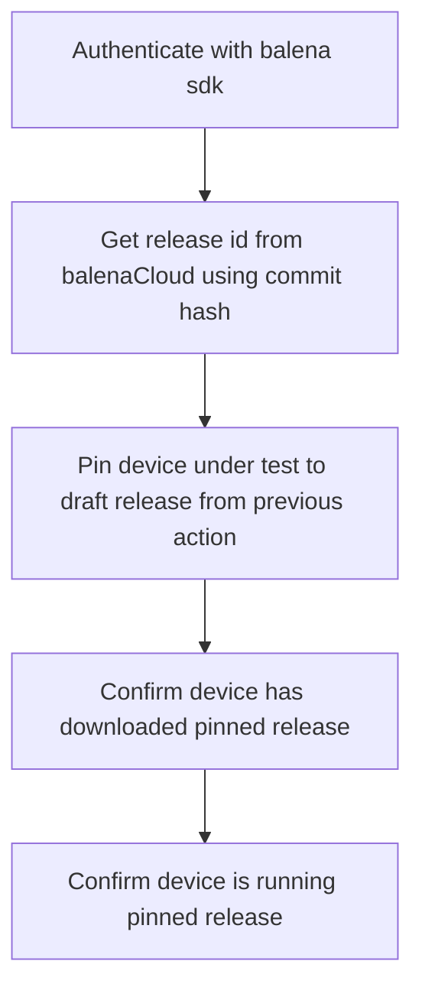

# Demo GitHub action for AutoKit testing

## Nomenclature

- DUT: Device Under Test

## Pin target test device under test to draft release

The first step is to look up the draft release associated with the commit under test.
This must be done in order to pin a predetermined device (via UUID) to the draft release that has been pushed to balenaCloud.

## Run `npm run balena-test` in GitHub action

Within this balena-test script, we expect there to be two types of workflow: one where the GitHub runner interacts directly with the DUT and the other where the GitHub runner interacts with an AutoKit which controls the DUT.
